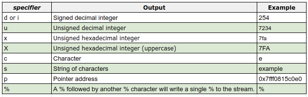

# ft_printf ♅

>Because putnbr and putstr aren’t enough

Library that contains ft_printf, a function that will mimic the real printf, It will manage the following conversions

### ft_printf.c

```c
int	ft_printf(const char *format, ...)
{
	va_list	ap;
	int		count;

	count = 0;
	va_start(ap, format);
	while (*format)
	{
		if (*format == '%')
		{
			ft_check_format(++format, &count, ap);
			format++;
		}
		else
		{
			write(1, format++, 1);
			count++;
		}
	}
	va_end(ap);
	return (count);
}
```

##  Format Specifiers


## Context

```c
int	ft_printf(const char *format, ...)
```
**[ flags ] [ width ] [ precision ]**

## Tester

- [ printfTester ](https://github.com/Tripouille/printfTester) (passed) from *Tripouille*

## Useful Links
- https://man7.org/linux/man-pages/man3/printf.3.html
- https://opensource.apple.com/source/xnu/xnu-201/osfmk/kern/printf.c.auto.html

 